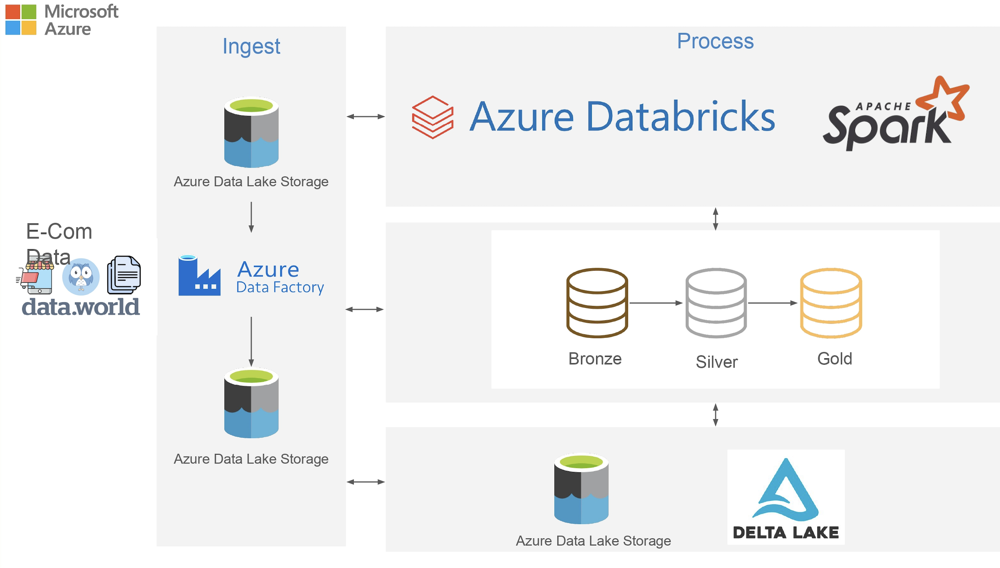

# Automation of End to End data pipeline of E commerce c2c data using Azure data factory and Azure Databricks
## Project Overview

This e-commerce project implements a comprehensive, end-to-end data pipeline solution using Microsoft Azure's cloud services. The architecture efficiently manages data ingestion, transformation, and analytics, tailored to handle the dynamic and complex data requirements of an e-commerce platform. It focuses on automation, scalability, and security to optimize the data flow.

## Technology Used

    Programming Language- Pyspark 
    
    Scripting Language - SQL
    
    Azure Cloud
    
    Azure Databricks
    
    Azure DataFactory
    
    Azure DataLake Storage Gen 2

**Key Components**:

**Azure Data Lake Storage Gen2**:

Purpose: Acts as a central, scalable, and secure repository for both structured and unstructured data.
Functionality: Data Lake Storage Gen2 houses all incoming raw data, including e-commerce transaction logs, customer interactions, and product data. Its hierarchical structure ensures efficient data organization, enhancing query performance and ease of data management.

**Azure Data Factory:**

Purpose: Orchestrates data movement, transformation, and automation for the entire pipeline.
Functionality: Data Factory pipelines extract raw data from multiple sources (e.g., transactional databases, external APIs), apply necessary transformations, and store it for further processing.
Triggers for Automation: Custom triggers have been configured to automate data ingestion processes. These triggers initiate data flows at predefined intervals or in response to specific events, ensuring timely and efficient data movement without manual intervention.
Integration: The seamless integration between Data Factory and other Azure components (such as Data Lake Storage and Databricks) ensures an automated, smooth flow of data across various stages of the pipeline.

**Azure Databricks:**

Purpose: Provides an environment for advanced analytics, machine learning, and automated ETL (Extract, Transform, Load) workflows.
Functionality: Databricks handles heavy data processing tasks, such as data cleaning, transformation, and analytics. The distributed computing capability allows it to scale based on data volumes, ensuring fast and efficient processing of large datasets.
Workflows for ETL Automation: Custom workflows have been implemented in Databricks to automate the ETL processes. These workflows handle everything from data ingestion and transformation to loading processed data into databases for analysis, eliminating the need for manual intervention and ensuring consistent data quality and availability.
Use Cases: Analytical models built in Databricks power e-commerce functions like customer segmentation, product recommendations, and sales forecasting.

**End-to-End Data Flow:**

**Data Ingestion:**

Raw data from e-commerce systems, customer interactions, and third-party sources is automatically ingested into Azure Data Lake Storage Gen2 using Azure Data Factory pipelines triggered at scheduled intervals or based on system events.

**Data Storage:**

All data is securely stored in Azure Data Lake Storage Gen2, enabling easy access for further processing.
Data Transformation & Automation: Azure Data Factory automates data transformation tasks. Using triggers, data pipelines are run automatically without human oversight. These tasks involve filtering, aggregating, and cleaning the data in preparation for analytics.

**Data Processing**:

Automated ETL workflows in Azure Databricks ensure that data is processed efficiently. Databricks executes complex data wrangling tasks and performs advanced analytics, transforming the data into insights or preparing it for machine learning models.
Data Consumption: Processed data is consumed by business intelligence tools for real-time insights and used to power machine learning models for predictive analysis, enhancing decision-making across the e-commerce platform.

**Benefits:**

**Automation:**

With triggers in Azure Data Factory and automated workflows in Azure Databricks, the entire data pipeline runs seamlessly without manual intervention, ensuring faster and more reliable data processing.

**Scalability:** 

Azure’s cloud-native infrastructure allows the solution to scale dynamically, adapting to growing data volumes and workloads.

**Security:**

Built-in security features such as encryption and access controls protect sensitive e-commerce data at every stage of the pipeline.

**Performance**:

The use of distributed computing with Azure Databricks ensures efficient processing of large datasets, allowing for near real-time analytics.

**Cost Efficiency**:

The serverless, pay-as-you-go model of Azure services keeps costs manageable, with resources scaling based on actual usage.
This project demonstrates how Azure cloud technologies, combined with automation, can be leveraged to create a powerful, end-to-end data pipeline that drives data-driven decision-making for an e-commerce business

**Dataset Used**
This dataset aims to serve as a benchmark for an e-commerce fashion store. Using this dataset, you may want to try and understand what you can expect of your users and determine in advance how your grows may be.

Here is the link to the dataset : https://data.world/jfreex/e-commerce-users-of-a-french-c2c-fashion-store
